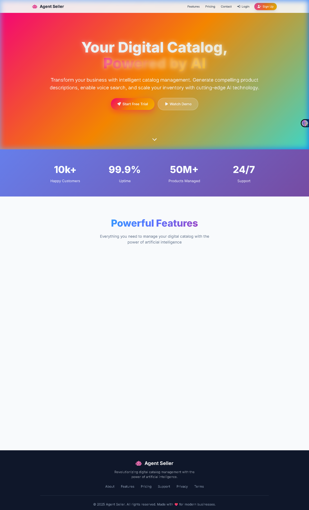
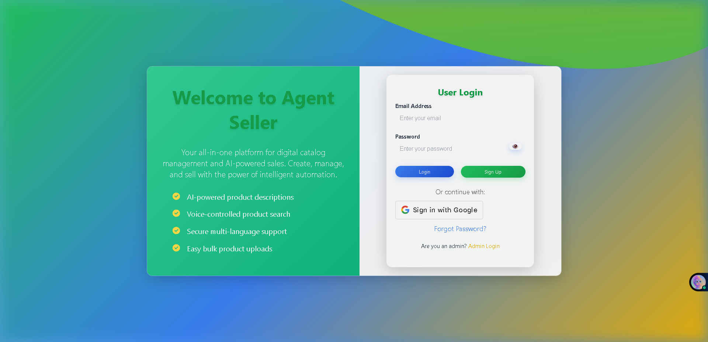
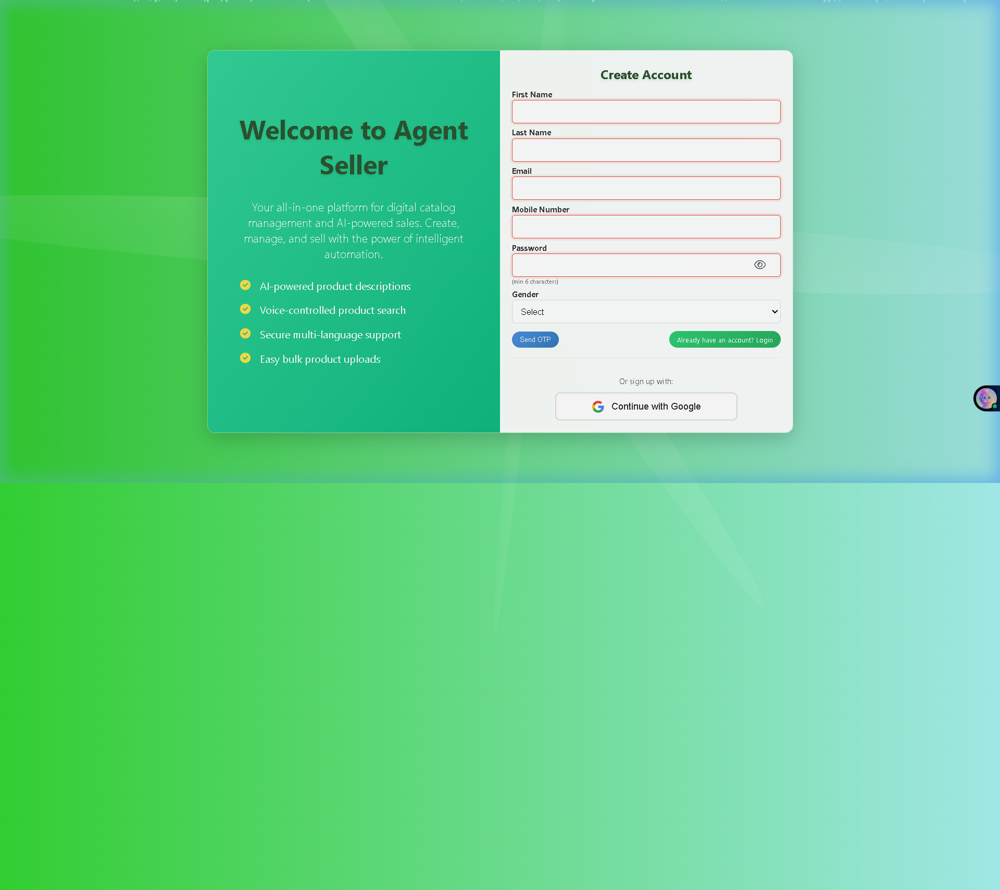
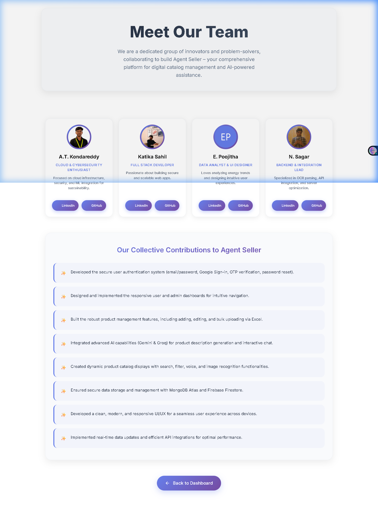
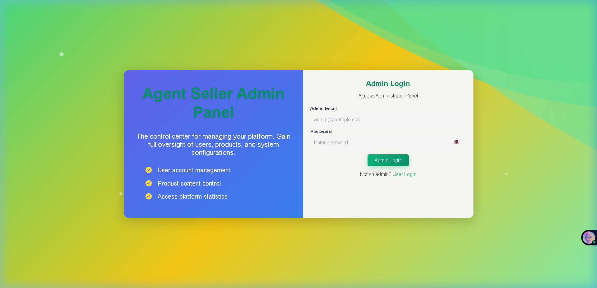
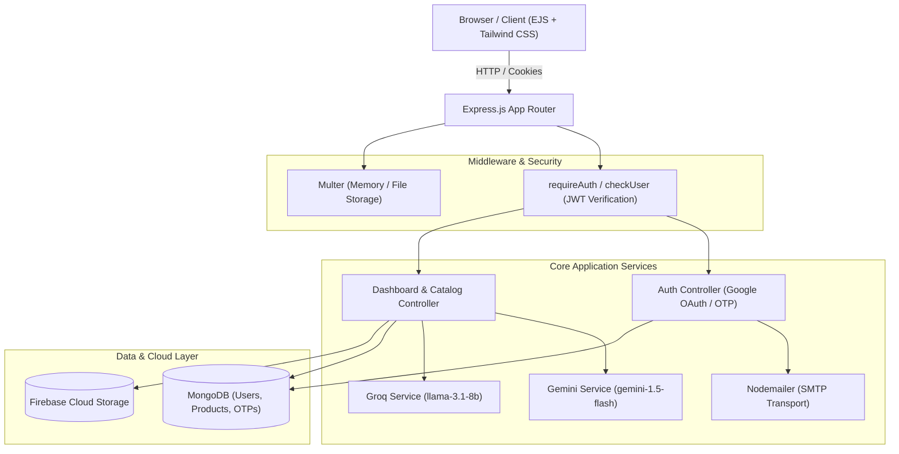

# 🚀 Agent Seller — AI-Powered E-Commerce Platform

[](LICENSE)
[](https://nodejs.org/)
[](https://expressjs.com/)
[](https://www.mongodb.com/)
[](https://firebase.google.com/)
[](https://ai.google.dev/)
[](https://groq.com/)
[](tests/)

**Agent Seller** is a full-stack, AI-enhanced e-commerce management platform designed to automate seller workflows, streamline product catalog operations, and deliver interactive AI assistance for modern digital storefronts.

[🌐 Live Demo](https://github.com/Kondareddy1209/Hackfinity-TechArmy) • [💻 Source Code](https://github.com/Kondareddy1209/Hackfinity-TechArmy) • [🎥 Demo Video](#-demo)

---

## 🎥 Demo

> 🎥 Demo video coming soon.

---

## 🖥️ Screenshots

| Platform View | Preview |
|---|---|
| **Platform Landing & Hero** |  |
| **User & Seller Login** |  |
| **Account Registration & OTP Flow** |  |
| **Meet Our Team & Roles** |  |
| **Admin Authentication Portal** |  |

---

## 🎯 Overview

Managing product catalogs and writing engaging, SEO-rich descriptions at scale is a significant bottleneck for independent sellers and multi-category merchants. Traditional e-commerce workflows require manual copy creation, disparate storage setups, and complex inventory management.

**Agent Seller** unifies catalog administration and generative AI inside a responsive web platform. Sellers can create listings, batch-import items via spreadsheets, and instantly generate market-ready product descriptions tailored to tone and target audience.

The platform integrates **Google Gemini 1.5 Flash** for rapid marketing copy generation alongside **Groq (Llama 3.1)** for conversational assistant queries. Authentication combines traditional email/password verification with Google OAuth 2.0 and OTP email flows, backed by role-based authorization for administrative governance.

---

## ✨ Key Features

### 🤖 AI Content Generation
- **Automated Copywriting**: Generates concise product descriptions from name, category, and keyword inputs using Google Gemini 1.5 Flash.
- **Tone & Language Customization**: Configurable tone settings (Professional, Engaging, Casual) and multilingual generation parameters.
- **Failover Resilience**: Automated fallback handling to alternative Gemini models if the primary model rate-limits or fails.

### 🧠 AI Assistant
- **Conversational Helper**: Real-time seller support powered by Groq's high-speed Llama 3.1 inference engine.
- **Structured JSON Mode**: Supports JSON-formatted responses for automated product metadata extraction.
- **Audio & Image Interaction Stubs**: Modular input pipelines for multimodal extensions.

### 🛍️ Product Management
- **Full Catalog CRUD**: Create, read, update, and delete products with keyword tagging and category filters.
- **Bulk Excel Upload**: Parse and import `.xlsx` / `.xls` spreadsheets directly into MongoDB via Multer memory storage.
- **Dynamic Search & Filtering**: Paginated product listings with regex-based search by name and description.

### 👤 Authentication & Role Authorization
- **Dual Authentication**: Google OAuth 2.0 ID token verification and traditional email/password signup.
- **Secure Password Hashing**: Passwords salted and hashed with bcrypt (10 rounds).
- **OTP Verification**: Nodemailer SMTP integration for 6-digit email verification and password reset workflows.
- **Role-Based Access Control**: HTTP-only JWT cookies protect seller endpoints and enforce strict administrator access on `/admin/*` routes.

### 📁 Media & Storage Management
- **Firebase Cloud Storage**: Secure media uploads with public bucket URL resolution and local fallback directories.
- **Form Handling**: Efficient multipart form processing supporting profile pictures and catalog images.

---

## 🏗️ Architecture



### Architectural Component Flow

```text
Client Browser (EJS / Tailwind CSS UI)
  │
  ▼
Express Application (app.js)
  │
  ├── Middleware (authMiddleware.js - JWT Authentication & Role Authorization)
  │
  ├── Routes & Controllers
  │     ├── auth.js            ──> Nodemailer (SMTP OTP) / Google OAuth 2.0 / User Model
  │     ├── dashboardRoutes.js ──> Product Model / Multer & XLSX Parser
  │     │                            ├──> geminiAgent.js (Google Gemini 1.5 Flash)
  │     │                            ├──> groqAgent.js (Groq Llama 3.1)
  │     │                            └──> Firebase Admin Storage
  │     └── admin.js           ──> User Governance & Role Modification
  │
  └── Persistence & Cloud Services
        ├── MongoDB (Users, Products, Otps)
        └── Firebase Cloud Storage (Images & Media)
```

---

## 🛠️ Tech Stack

| Layer | Technologies |
|---|---|
| **Frontend / UI** | EJS (Embedded JavaScript), Tailwind CSS, Lucide Icons |
| **Backend Framework** | Node.js (v18+), Express.js (v5.1) |
| **Database** | MongoDB, Mongoose ODM (v8.16) |
| **Authentication** | JWT (`jsonwebtoken`), Google Auth Library, `bcryptjs` |
| **AI & LLM Services** | Google Generative AI (`@google/generative-ai`), Groq SDK (`groq-sdk`) |
| **Cloud Storage** | Firebase Admin SDK (`firebase-admin/storage`) |
| **File Processing** | Multer, SheetJS (`xlsx`) |
| **Email & Transport** | Nodemailer (SMTP) |
| **Testing** | Jest (v30), Supertest (v7) |
| **Containerization** | Docker (Alpine Node 20) |

---

## 🔌 API Reference

### Authentication Endpoints

| Method | Endpoint | Description | Auth Required |
|---|---|---|---|
| `GET` | `/auth/login` | Renders user login interface | None |
| `POST` | `/auth/login` | Authenticates user; sets HTTP-only JWT cookie | None |
| `GET` | `/auth/signup` | Renders user registration interface | None |
| `POST` | `/auth/signup` | Creates unverified user and emails verification OTP | None |
| `POST` | `/auth/verify-otp` | Validates 6-digit OTP code and marks account verified | None |
| `POST` | `/auth/resend-otp` | Issues a new OTP email | None |
| `POST` | `/auth/google` | Verifies Google OAuth token & establishes session | None |
| `GET` | `/auth/logout` | Clears JWT session cookie | `JWT` |

### Product & Catalog Endpoints

| Method | Endpoint | Description | Auth Required |
|---|---|---|---|
| `GET` | `/api/products` | Paginated JSON product list with search (`q`) and `category` | `JWT` |
| `GET` | `/user/all-products` | Renders browseable product catalog | `JWT` |
| `GET` | `/user/my-catalog` | Renders seller's product catalog | `JWT` |
| `POST` | `/user/listings` | Creates a new product listing with image upload | `JWT` |
| `POST` | `/user/my-catalog/edit/:id`| Updates product listing details | `JWT` |
| `POST` | `/api/admin/products/bulk-upload` | Bulk imports products from `.xlsx` spreadsheet | `JWT` (Admin) |

### AI & Assistant Endpoints

| Method | Endpoint | Description | Auth Required |
|---|---|---|---|
| `POST` | `/api/generate-description` | Generates AI product description via Google Gemini | `JWT` |
| `POST` | `/api/grok-chat` | Chat completion via Groq Llama 3.1 (text/JSON) | `JWT` |
| `POST` | `/api/grok-chat-audio` | Audio input bridge endpoint | `JWT` |
| `POST` | `/api/grok-chat-photo` | Image analysis bridge endpoint | `JWT` |

### Admin Endpoints

| Method | Endpoint | Description | Auth Required |
|---|---|---|---|
| `GET` | `/admin/users` | Lists all users with role management options | `JWT` (Admin) |
| `POST` | `/admin/users/update-role/:id` | Updates user authorization role (`user`/`admin`) | `JWT` (Admin) |
| `POST` | `/admin/users/delete/:id` | Deletes user account | `JWT` (Admin) |

---

## 🚀 Getting Started

### Prerequisites
- **Node.js** (v18.0.0 or higher)
- **MongoDB** instance (Local or MongoDB Atlas)
- **Google AI Studio API Key** (for Gemini description generation)
- **Groq API Key** (for chat assistant)
- *(Optional)* **Firebase Project** with Storage enabled & Gmail SMTP app password

### 1. Clone & Install
```bash
git clone https://github.com/Kondareddy1209/Hackfinity-TechArmy.git
cd Hackfinity-TechArmy
npm install
```

### 2. Environment Setup
Create your local environment configuration file from the template:
```bash
cp .env.example .env
```
Update `.env` with your MongoDB URI, JWT secret, and AI API keys.

### 3. Run the Application
```bash
# Development mode (with nodemon auto-reloading)
npm run dev

# Production start
npm start
```
Access the application at `http://localhost:3000`.

---

## 🔐 Environment Variables

| Variable | Description | Required |
|---|---|---|
| `PORT` | Server listening port (default: `3000`) | Optional |
| `NODE_ENV` | Environment mode (`development` / `production` / `test`) | Required |
| `MONGO_URI` | MongoDB connection connection string | Required |
| `JWT_SECRET` | Secret key for signing and verifying JWT cookies | Required |
| `GOOGLE_API_KEY` | Google Gemini API key for description generator | Optional* |
| `GROQ_API_KEY` | Groq Cloud API key for Llama 3.1 chat completions | Optional* |
| `GOOGLE_CLIENT_ID` | Google OAuth 2.0 Client ID for web sign-in | Optional |
| `FIREBASE_STORAGE_BUCKET` | Google Cloud Storage / Firebase bucket name | Optional |
| `FIREBASE_SERVICE_ACCOUNT_KEY_PATH` | Path to Firebase Admin service account JSON | Optional |
| `EMAIL_USER` / `EMAIL_PASS` | SMTP credentials for sending OTP verification emails | Optional |

*\* AI features will return a graceful configuration notice if keys are omitted.*

---

## 🧪 Testing

The test suite runs with Jest and Supertest, verifying route availability, HTTP status codes, unauthenticated security protections, password hashing, and AI service mocks with zero external API consumption.

```bash
# Execute all automated tests
npm test
```

### Test Results:
```text
PASS tests/ai.test.js
PASS tests/auth.test.js
PASS tests/app.test.js

Test Suites: 3 passed, 3 total
Tests:       22 passed, 22 total
Snapshots:   0 total
Time:        5.257 s
```

---

## 📁 Project Structure

```text
Hackfinity-TechArmy/
├── app.js                   # Express application entry & middleware orchestration
├── package.json             # Project dependencies and npm scripts
├── Dockerfile               # Production container definition
├── .env.example             # Safe environment variable configuration template
├── middleware/
│   └── authMiddleware.js    # JWT verification & role authorization guards
├── models/
│   ├── User.js              # User schema with bcrypt pre-save hooks
│   ├── Product.js           # Product catalog schema
│   └── Otp.js               # 5-minute expiration OTP token schema
├── routes/
│   ├── auth.js              # Authentication, Google OAuth, & OTP routes
│   ├── admin.js             # User administration & role modification routes
│   └── dashboardRoutes.js   # Product CRUD, Excel bulk upload, & AI endpoints
├── services/
│   ├── geminiAgent.js       # Google Gemini 1.5 Flash content generation service
│   └── groqAgent.js         # Groq SDK Llama 3.1 chat completion service
├── views/
│   ├── partials/            # Reusable navbar and footer components
│   ├── index.ejs            # Platform landing page
│   ├── team.ejs             # Team member profiles and contributions
│   ├── 403.ejs / 404.ejs    # Custom HTTP error pages
│   └── *.ejs                # Dashboard, product, and AI tool templates
├── public/                  # Static styles, client scripts, and uploads
├── screenshots/             # Repository preview screenshots
└── tests/
    ├── app.test.js          # Core route & authorization security tests
    ├── auth.test.js         # Password hashing & JWT token unit tests
    └── ai.test.js           # Fully mocked AI service integration tests
```

---

## 👤 Team & Contributions

This project was built collaboratively by **Hackfinity TechArmy**:
- **A.T. Kondareddy** ([@Kondareddy1209](https://github.com/Kondareddy1209)) — Cloud Architecture, AI Integration, Security & QA
- **Katika Sahil** ([@sahi-sahils](https://github.com/sahi-sahils)) — Full Stack Development & UI
- **E. Poojitha** ([@192211190](https://github.com/192211190)) — Data Analysis & UI Design
- **N. Sagar** ([@sagar7121](https://github.com/sagar7121)) — Backend & Integration Lead

### 🛡️ My Specific Contributions (A.T. Kondareddy):
- **Cloud & Storage Architecture**: Designed the Firebase Admin SDK and Google Cloud Storage upload pipeline with fallback configurations.
- **AI Agent Integration**: Implemented and structured the Google Gemini 1.5 Flash product description generator and Groq Llama 3.1 service layer with automated model fallback.
- **Authentication & Security**: Configured JWT cookie management, bcrypt password salting hooks, and route protection middleware.
- **Quality Assurance & Testing**: Designed the automated Jest & Supertest test suite (22 unit & integration tests) covering route security, authentication mechanics, and zero-credit mocked AI execution.
- **Repository Audit & Hardening**: Refactored environment configuration isolation, error templates (`403.ejs`, `500.ejs`), and Docker packaging.

---

## 🗺️ Roadmap

- [ ] **Payment Gateway**: Integration with Stripe / Razorpay for direct in-platform checkouts.
- [ ] **Real Multimodal Vision**: Upgrading image analysis from simulated stubs to live Gemini 1.5 Pro multimodal processing.
- [ ] **Webhooks & Storefront Sync**: Automated export integrations to Shopify, WooCommerce, and Amazon.
- [ ] **Fine-Tuned Seller Agents**: Custom system prompts and inventory analytics based on historical sales data.

---

## 📄 License

Distributed under the **ISC License**. See [`LICENSE`](LICENSE) for details.
